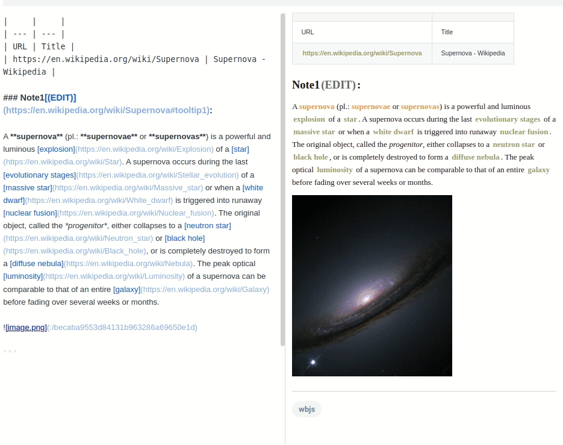
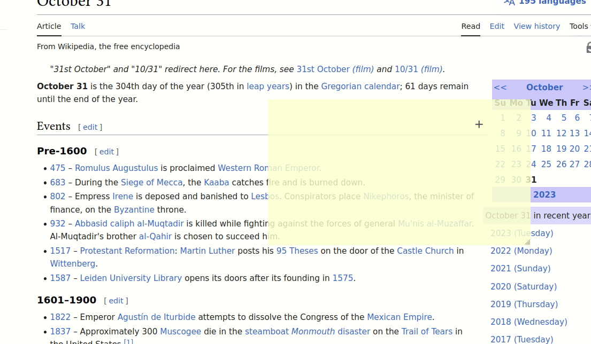

## WebResearcherJS

Annotate your favorite webpages effortlessly and export to Joplin with ease using the WebResearcherJS Firefox extension. Download now from the add-on page ([https://addons.mozilla.org/en-US/firefox/addon/webresearcherjs/](https://addons.mozilla.org/en-US/firefox/addon/webresearcherjs/)) to supercharge your research and note-taking game.

## Getting Started
- Press the WebResearcherJS extension button on the toolbar.

- Copy and paste the Joplin authorization token from `Tools->Options->Web Clipper`. Set the contextual highlighting to false.

- Save the settings. 

## Core features
- Take multiple notes on any webpage by highlighting a text and pressing Ctrl+1 to start a note

  - These notes are automatically saved to your local storage and will be displayed the next time you visit the page. 
  - You can also export to them to Joplin by pressing the 'save to Joplin' button

- Want to make changes to the exported note? Just click on the 'EDIT' button to go back to the webpage and edit the note. Resave the updated note back to Joplin. See demo below:

## Experimental features
- If you set the contextual highlighting to true when configuring the extension, this feature will try to find that sentence in the webpage and highlight it for you.

## Video demo
[https://www.youtube.com/watch?v=tJVW2UeUl9E](https://www.youtube.com/watch?v=tJVW2UeUl9E)

## Support and development
Checkout the notes posted [here](docs/docs.md) to understand how the source code works. Code, suggestions, and feedback are welcome.

